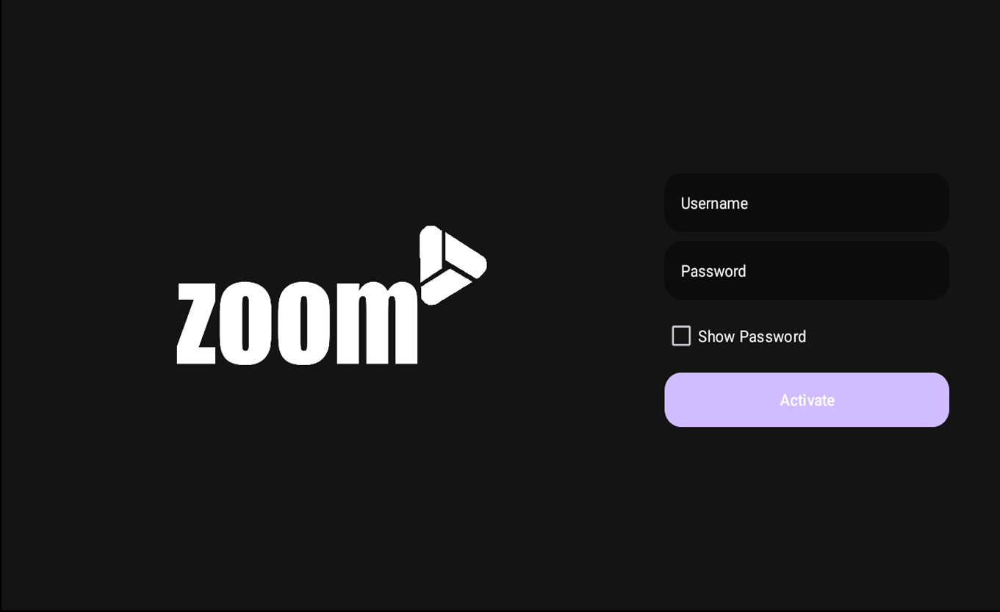
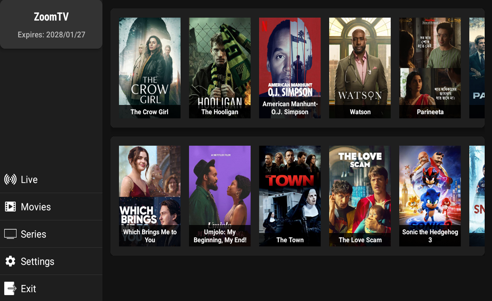
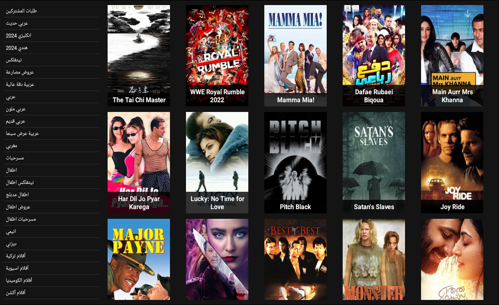
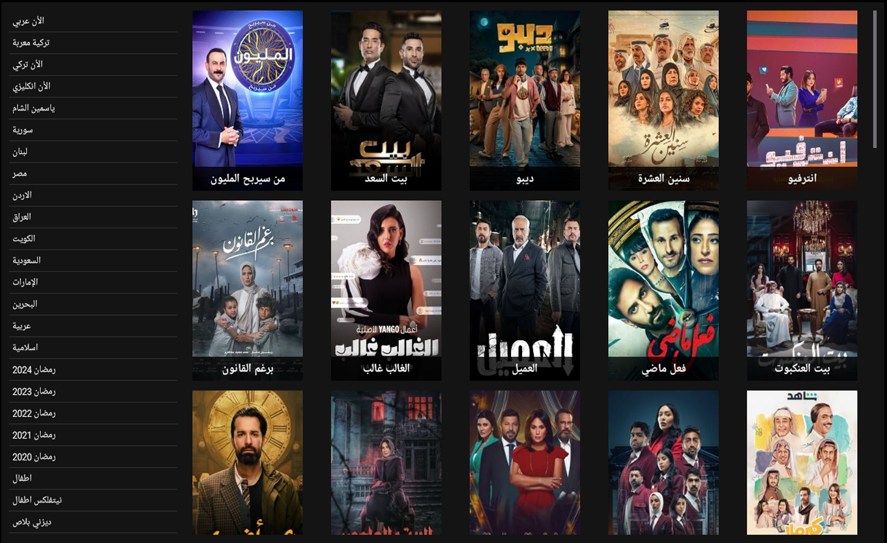
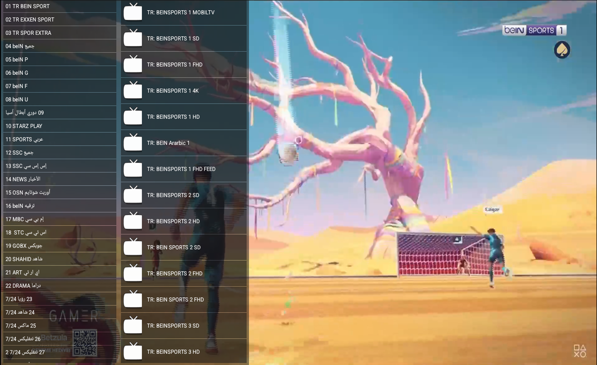
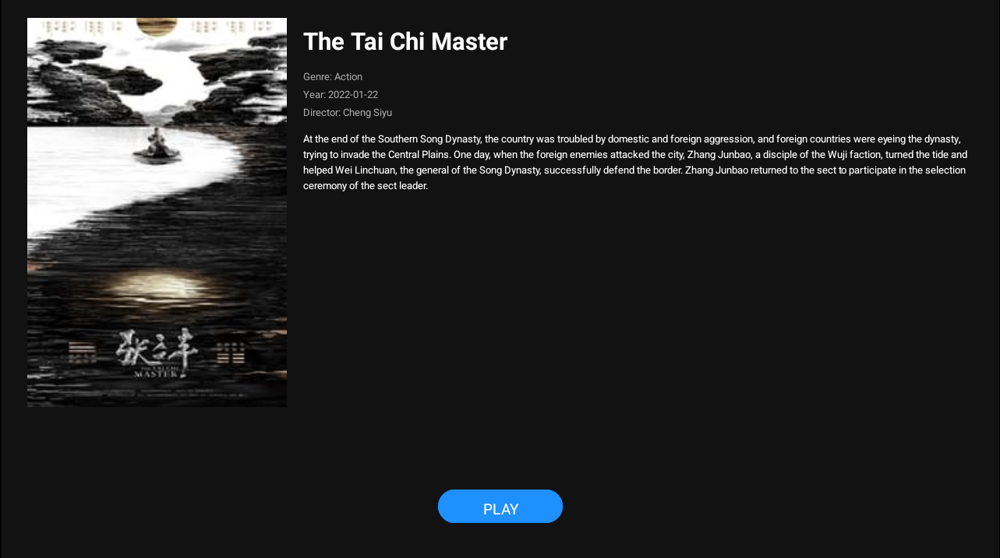
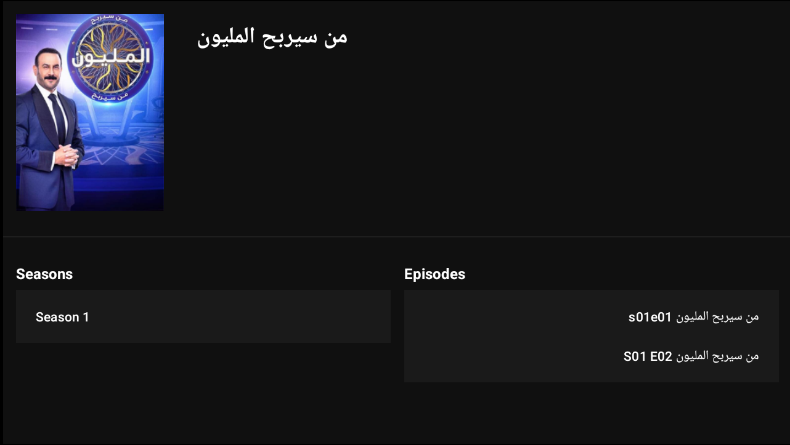

# IPTV App

**This software is a paid IPTV app developed for Android devices. It offers high-quality, seamless streaming and provides users with easy access to a wide range of content, making home entertainment more enjoyable.**

## Features:
- **Login**: A login screen that allows users to sign in to their accounts. Provides access to personal content.
- **Home**: Explore and access various content available on the platform.
- **Movies**: A section dedicated to movies across different genres for easy browsing.
- **Series**: Browse and explore different series categories.
- **Live**: Watch live streaming content in real-time.
- **Series Info**: View detailed information about series, including descriptions, episodes, and more.
- **Movies Info**: Get detailed information about movies, including synopses, ratings, cast, and more.
- **Player**: A built-in video player for seamless streaming with high-quality playback.

## Screenshots:

## Purchase:
This software is a commercial product and is available for sale under specific licenses. For purchasing and licensing information, please contact us.

**Contact:** v2hestia@gmail.com

## License:
This software is a commercial product for sale. For licensing information, please contact us.
